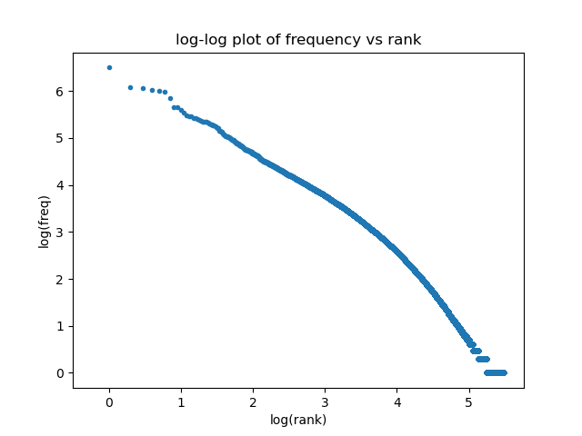
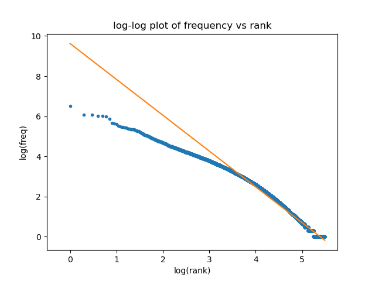
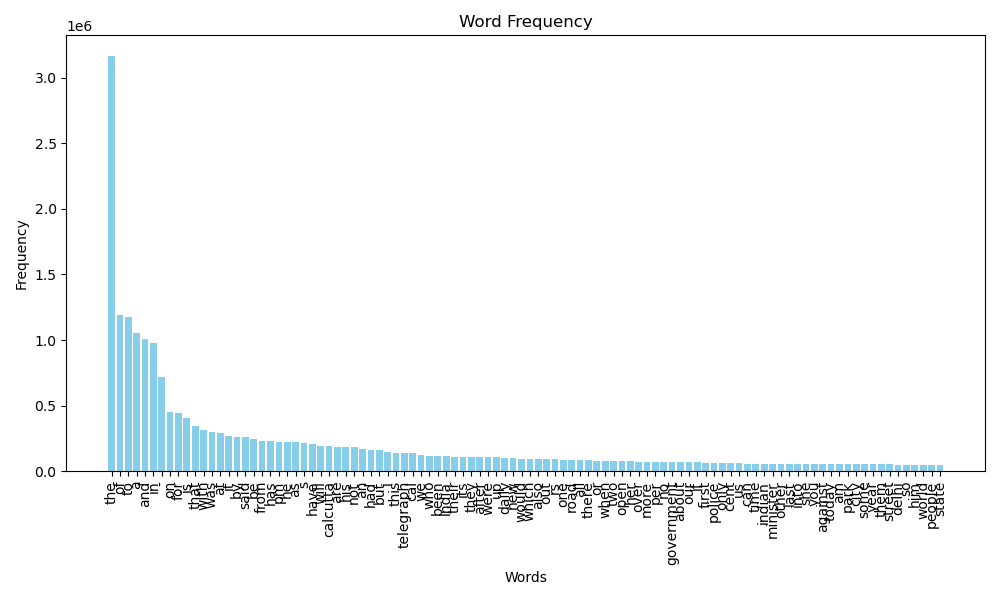
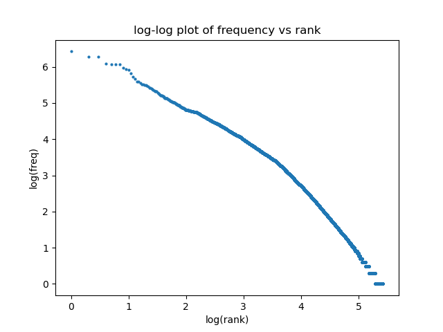
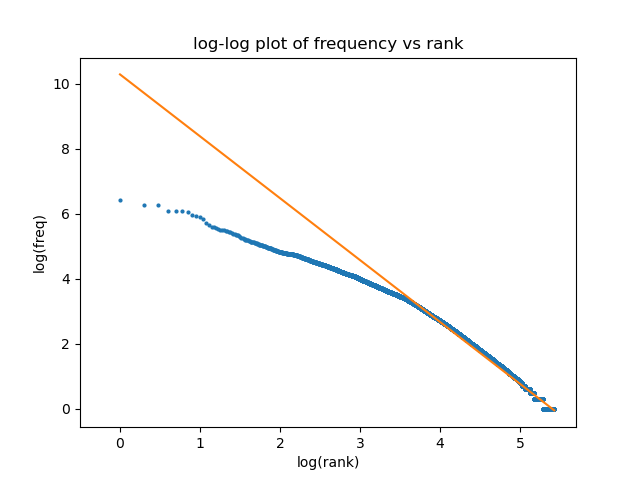
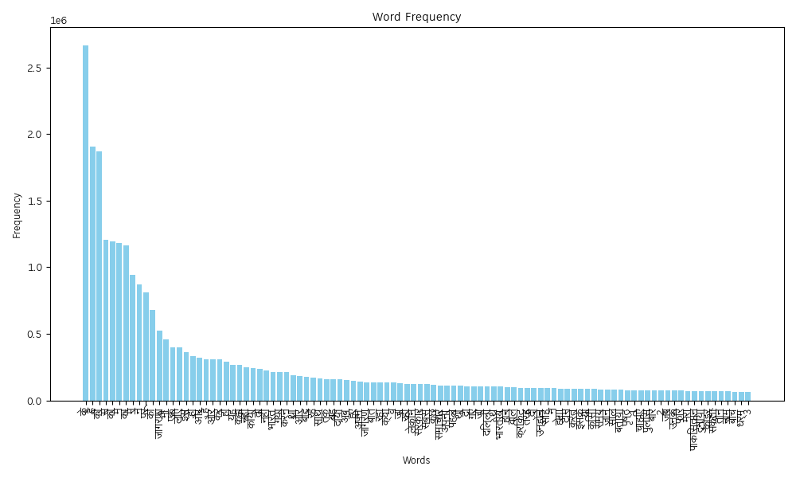

| | |
|-|-|
|`Name`|Arnav Kumar Sinha|
|`Roll No.`| 22075013 |
|`Course`| B.Tech CSE |

# Table Of Contents
<!--toc:start-->
- [Table Of Contents](#table-of-contents)
- [Analysis](#analysis)
  - [Zipf's Law](#zipfs-law)
    - [English Zipf](#english-zipf)
    - [Hindi Zipf](#hindi-zipf)
  - [Stemming](#stemming)
    - [English Stemming](#english-stemming)
    - [Hindi Stemming](#hindi-stemming)
    - [Analysis and Results](#analysis-and-results)
<!--toc:end-->

\newpage

# Analysis

## Zipf's Law

> [!NOTE]
> Code related to this can be found in directory [`zipfs-law`](./zipfs-law/) 

### English Zipf

For the English Dataset, it doesn't seem to follow zipf's law precisely.

Using, ignoring numbers and punctuation (except the hyphen), here is the log-log plot of frequency vs rank,

 
and now with a best-fit line
 

For a dataset following Zipf's law, the log-log plot should have been almost linear, but here the $R^2$ value is around $0.9828\ldots$

Here are the 40 most common words in the collection with their frequencies:

| Term | Frequency |
| ---- | --------- |
| the | 3165967|
| of | 1191753|
| to | 1173978|
| a | 1052318|
| and | 1009427|
| in | 975690|
| - | 718358|
| on | 452788|
| for | 446121|
| is | 405643|
| that | 340393|
| with | 310592|
| was | 295030|
| at | 291176|
| it | 268103|
| by | 261282|
| said | 256954|
| be | 241164|
| from | 232918|
| has | 226159|
| pm | 221154|
| he | 218450|
| as | 218228|
| s | 217175|
| have | 208039|
| will | 194965|
| calcutta | 192773|
| are | 185001|
| his | 183397|
| not | 182055|
| an | 170376|
| had | 161636|
| but | 160628|
| i | 143241|
| this | 139506|
| telegraph | 139167|
| cal | 135123|
| we | 123564|
| who | 118165|
| been | 116681|

The tokenization step involved matching with this regex expression `[a-zA-Z\-]+`, which ignores numbers and punctuation (other than the hyphen) and then lowercasing the matches

Some weird tokens are

- `-`
    - obviously due to the tokenization scheme
- `s`
    - this weird token occurs so many times, because in the dataset, the words like `that's` look like `that?s`, `country's -> country?s`, `army's -> army?s`

> [!NOTE]
> Associated code can be found in [`english analysis`](./zipfs-law/english-analysis.py) 

### Hindi Zipf

For the Hindi Dataset, it doesn't seem to follow zipf's law precisely.

Here is the log-log plot of frequency vs rank,

and now with a best-fit line

For a dataset following Zipf's law, the log-log plot should have been almost linear, but here the $R^2$ value is around $0.9768\ldots$

Here are the 40 most common words in the collection with their frequencies:

| Term (wxn) | Frequency |
| - | - |
| ke | 2666812 |
| hai | 1903989 |
| kI | 1868646 |
| se | 1204763 |
| ko | 1193956 |
| me | 1180160 |
| kA | 1161792 |
| meM | 942672 |
| ne | 872033 |
| para | 809653 |
| ki | 677851 |
| jAgaraNA | 521605 |
| bhI | 459633 |
| eka | 395570 |
| lie | 395319 |
| isa | 363829 |
| hI | 334565 |
| aura | 320864 |
| haiM | 308684 |
| aAaira | 307561 |
| kara | 306016 |
| ho | 290355 |
| yaha | 268787 |
| kahA | 266529 |
| nahIM | 249308 |
| kiyA | 243252 |
| to | 234119 |
| nahI | 225234 |
| bhArata | 215572 |
| gayA | 214916 |
| karane | 213012 |
| thA | 190662 |
| aaura | 185410 |
| bAda | 174859 |
| rahe | 168503 |
| sAtha | 164968 |
| taka | 161141 |
| vaha | 161001 |
| diyA | 156540 |
| aba | 152971 |

The tokenization step involved matching with this regex expression `\w+` along with `UNICODE` flag set, which doesnot ignore numbers and punctuation

> [!NOTE]
> Associated code can be found in [`hindi analysis`](./zipfs-law/hindi-analysis.py) 

## Stemming

### English Stemming

Porter stemmer was used for this english stemming. It was taken from the [*`snowball project`*](https://snowballstem.org/algorithms/porter/stemmer.html).

Detailed stemming description can be found in [*stemming/porter.sbl*](./stemming/porter.sbl) 

Steps of the Algorithm:

1) Deals with plurals and past participles. 
    - Removes common endings like -SSES, -IES, -ED, -ING, and modifies endings based on conditions.
2) Targets specific suffixes that indicate derivational forms.
    - Examples include -ATIONAL -> -ATE, -TIONAL -> -TION, etc.
3) Further reduces words by removing suffixes like -ICATE, -ATIVE, -ALIZE, etc.
4) Focuses on removing additional suffixes based on the measure of the stem.
    - Examples include -AL, -ANCE, -ENCE, -ER, etc.
5) Final tidying up of the stem. Removes trailing -E based on conditions related to the measure.

### Hindi Stemming

The Hindi stemmer was taken from [*`here`*](https://web.archive.org/web/20160628180847/http://www.kbcs.in/downloads/papers/StmmerHindi.pdf) 

Detailed stemming description can be found in [*stemming/hindi.sbl*](./stemming/hindi.sbl) 

In [*`WX Notation`*](https://en.wikipedia.org/wiki/WX_notation), the stemmer is implemented by simply removing from each word the longest possible suffix from this list:

| | | | | |
|-|-|-|-|-|
| `A`     | `AeM`   | `awA`   | `Ane`   | `egA`   | 
| `i`     | `AoM`   | `awI`   | `UMgA`  | `egI`   | 
| `I`     | `iyAM`  | `IM`    | `UMgI`  | `AegA`  | 
| `u`     | `iyoM`  | `awIM`  | `AUMgA` | `AegI`  | 
| `U`     | `AiyAM` | `awe`   | `AUMgI` | `AyA`   | 
| `e`     | `AiyoM` | `AwA`   | `eMge`  | `Ae`    | 
| `o`     | `AMh`   | `AwI`   | `eMgI`  | `AI`    | 
| `eM`    | `iyAMh` | `AwIM`  | `AeMge` | `AIM`   | 
| `oM`    | `AiyAMh`| `Awe`   | `AeMgI` | `ie`    | 
| `AM`    | `awAeM` | `anA`   | `oge`   | `Ao`    | 
| `uAM`   | `awAoM` | `anI`   | `ogI`   | `Aie`   | 
| `ueM`   | `anAeM` | `ane`   | `Aoge`  | `akara` | 
| `uoM`   | `anAoM` | `AnA`   | `AogI`  | `Akara` | 

The [*snowball*](https://snowballstem.org/algorithms/hindi/stemmer.html) file for this can be found [*`here`*](./stemming/hindi.sbl) 

### Analysis and Results

The script [`analyze.sh`](./stemming/analyze.sh) was written to record the process used to extract the required stats.

Scripts [`gen-hindi-terms.py`](./stemming/gen-hindi-terms.py) and [`gen-english-terms.py`](./stemming/gen-english-terms.py) were used to extract words from document collection.

|Type | Count |
|-|-|
|Unique         hindi  | 268089 |
|Stemmed unique hindi  | 215072 |
|Unique         english  | 250704 |
|Stemmed unique english  | 194800 |

All code and intermediate files can be found in directory [`stemming`](./stemming/) 
