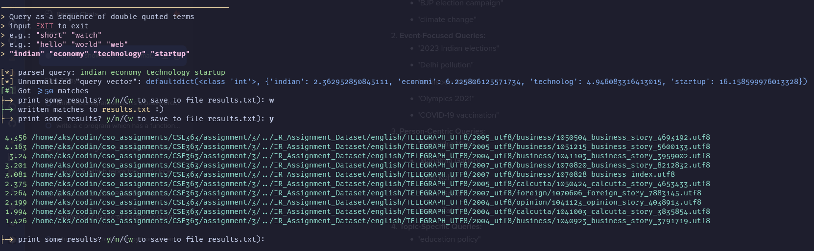
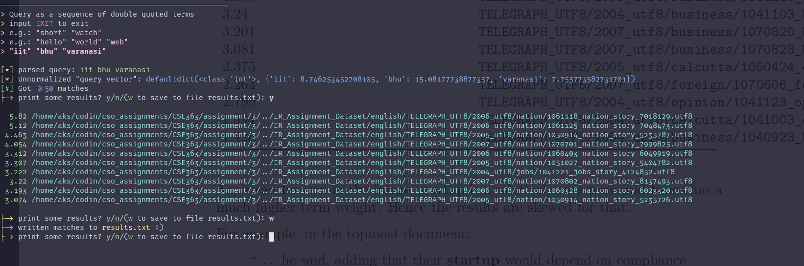
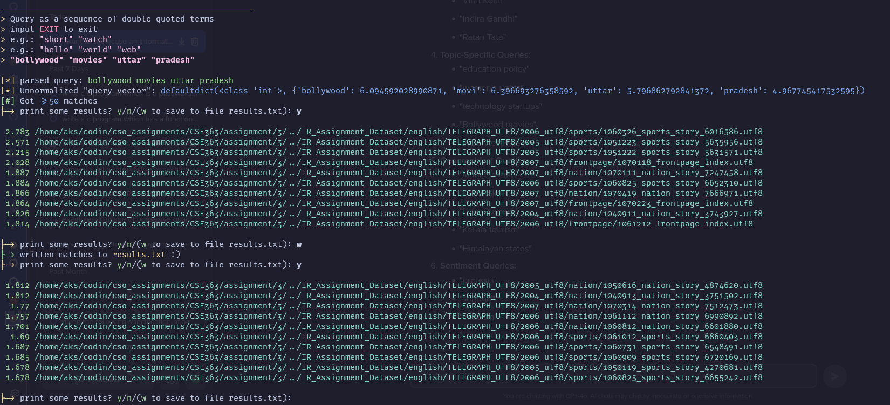

| | |
|-|-|
|`Name`|Arnav Kumar Sinha|
|`Roll No.`| 22075013 |
|`Course`| B.Tech CSE |

# Table Of Contents

<!--toc:start-->
- [Table Of Contents](#table-of-contents)
- [Examples](#examples)
  - [Indian Economy Technology Startup](#indian-economy-technology-startup)
  - [IIT BHU Varanasi](#iit-bhu-varanasi)
  - [Bollywood Movies Uttar Pradesh](#bollywood-movies-uttar-pradesh)
<!--toc:end-->

\newpage

# Examples

NOTE: A common theme among the top matches are that they have smaller length and match some relevant terms. 
This may be due to using $(1+\log(1+tf))\cdot\log\frac{N}{idf}$ as the weighting function. Since the documents themselves are not very large, the sublinear $tf$ term is not helping that much.

## Indian Economy Technology Startup

 

|matching weight| doc name |
|-|-|
|4.356| `TELEGRAPH_UTF8/2005_utf8/business/1050504_business_story_4693192.utf8` |
|4.163| `TELEGRAPH_UTF8/2005_utf8/business/1051215_business_story_5600133.utf8` |
| 3.24| `TELEGRAPH_UTF8/2004_utf8/business/1041103_business_story_3959002.utf8` |
|3.201| `TELEGRAPH_UTF8/2007_utf8/business/1070820_business_story_8212832.utf8` |
|3.081| `TELEGRAPH_UTF8/2007_utf8/business/1070828_business_index.utf8` |
|2.375| `TELEGRAPH_UTF8/2005_utf8/calcutta/1050424_calcutta_story_4653433.utf8` |
|2.264| `TELEGRAPH_UTF8/2007_utf8/foreign/1070606_foreign_story_7883145.utf8` |
|2.199| `TELEGRAPH_UTF8/2004_utf8/opinion/1041123_opinion_story_4038913.utf8` |
|1.994| `TELEGRAPH_UTF8/2004_utf8/calcutta/1041003_calcutta_story_3835854.utf8` |
|1.426| `TELEGRAPH_UTF8/2004_utf8/business/1040923_business_story_3791719.utf8` |

As, it can be seen in the image, startup is a relatively rare term and hence has a much higher term weight. Hence the results are skewed for that.

For example, in the topmost document:

> `` \dots he said, adding that their **startup** would depend on compliance with govern \dots''

Other matches are also the terms. They are lower down the list primarily because they are much larger documents.

\newpage

## IIT BHU Varanasi

 

| | |
|-|-|
|   5.82 | `TELEGRAPH_UTF8/2006_utf8/nation/1061118_nation_story_7018129.utf8` |
|   5.12 | `TELEGRAPH_UTF8/2006_utf8/nation/1061125_nation_story_7048473.utf8` |
|  4.463 | `TELEGRAPH_UTF8/2005_utf8/nation/1050914_nation_story_5235787.utf8` |
|  4.054 | `TELEGRAPH_UTF8/2007_utf8/nation/1070701_nation_story_7999825.utf8` |
|  3.312 | `TELEGRAPH_UTF8/2006_utf8/nation/1060403_nation_story_6049919.utf8` |
|  3.307 | `TELEGRAPH_UTF8/2005_utf8/nation/1051027_nation_story_5404782.utf8` |
|  3.222 | `TELEGRAPH_UTF8/2004_utf8/jobs/1041221_jobs_story_4124852.utf8` |
|   3.22 | `TELEGRAPH_UTF8/2007_utf8/nation/1070802_nation_story_8137493.utf8` |
|  3.193 | `TELEGRAPH_UTF8/2006_utf8/nation/1060328_nation_story_6023320.utf8` |
|  3.074 | `TELEGRAPH_UTF8/2005_utf8/nation/1050914_nation_story_5235726.utf8` |

The matches are relevant to BHU, IITs etc. 
More finegrained results can be obtained by further adding relevant terms like *technology*, or maybe about specific departments *chemical*

\newpage
## Bollywood Movies Uttar Pradesh

 

| | |
|-|-|
|   5.82 | `TELEGRAPH_UTF8/2006_utf8/nation/1061118_nation_story_7018129.utf8` |
|   5.12 | `TELEGRAPH_UTF8/2006_utf8/nation/1061125_nation_story_7048473.utf8` |
|  4.463 | `TELEGRAPH_UTF8/2005_utf8/nation/1050914_nation_story_5235787.utf8` |
|  4.054 | `TELEGRAPH_UTF8/2007_utf8/nation/1070701_nation_story_7999825.utf8` |
|  3.312 | `TELEGRAPH_UTF8/2006_utf8/nation/1060403_nation_story_6049919.utf8` |
|  3.307 | `TELEGRAPH_UTF8/2005_utf8/nation/1051027_nation_story_5404782.utf8` |
|  3.222 | `TELEGRAPH_UTF8/2004_utf8/jobs/1041221_jobs_story_4124852.utf8` |
|   3.22 | `TELEGRAPH_UTF8/2007_utf8/nation/1070802_nation_story_8137493.utf8` |
|  3.193 | `TELEGRAPH_UTF8/2006_utf8/nation/1060328_nation_story_6023320.utf8` |
|  3.074 | `TELEGRAPH_UTF8/2005_utf8/nation/1050914_nation_story_5235726.utf8` |

\newpage

 
