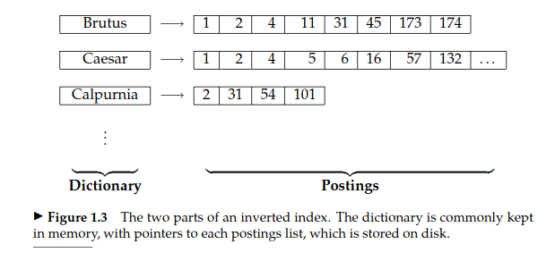
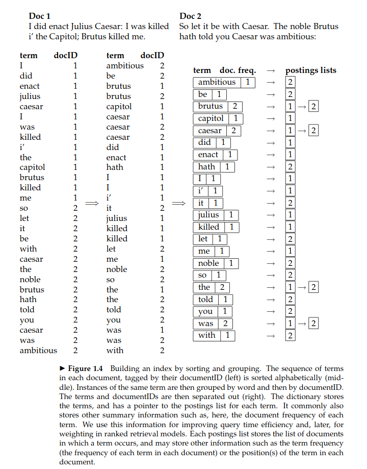

# Boolean Retrieval

[Book Link](https://nlp.stanford.edu/IR-book/pdf/01bool.pdf) 

|       | Antony and Cleopatra|Julius Caesar|The Tempest|Hamlet|Othello|Macbeth|
|:------|:-------------------:|:-----------:|:---------:|:----:|:-----:|:-----:|
|Antony|1|1|0|0|0|1|
|Brutus|1|1|0|1|0|0|
|Caesar|1|1|0|1|1|1|
|Calpurnia|0|1|0|0|0|0|
|Cleopatra|1|0|0|0|0|0|
|mercy|1|0|1|1|1|1|
|worser|1|0|1|1|1|0|

> A term-document incidence matrix. Matrix element (t, d) is 1 if the
play in column d contains the word in row t, and is 0 otherwise.

- Consider a dictionary of terms (unique terms present in the document collection)
    - say there are n terms
- Say there are m documents
- Map each document to a boolean vector
    - for the kth document, its corresponding vector will have a 1 in position i iff the kth document contains atleast one occurence of the ith dictionary term
    - This is called Document-Term incidence matrix
    - ranking can be done using dot product (which can be computed faster using bitwise operations)
        - ranking cannot be done in documents containing the same occurences 
- It can also be done in a way called Term-Document incidence matrix
    - idhar we use the transpose of document-term matrix matrix
    - speeds up calculations if m > n 
        - usual case, since number of words in a dictionary ~10^5, number of documents ~10^6
    - No ranking is possible
- For large collections, storing the incidence matrix in memory is not feasible
    - It is expected that the matrix will be relatively sparse, hence linked list type structure is used
    - Each word has a list which contains the "name" of documents which contain this word
    - Even during query, you don't need to fetch the whole mapping, can only fetch only relevant terms and corresponding list
    - This approach is called the *inverted index*
    -  
    -  

## Query Processing Order

For example, to process 
```
(tangerine    OR trees) AND
(marmalade    OR skies) AND
(kaleidoscope OR eyes)
```
Given the stats

|word| freq|
|:-:|-|
|eyes | 213312|
|kaleidoscope | 87009|
|marmalade| 107913|
|skies| 271658|
|tangerine| 46653|
|trees |316812|

Given two lists A and B (say |A| < |B|), then
|A OR  B| lies in \[ |B|, |A|+|B| \], and
|A AND B| lies in \[   0, |A| ]

- Process:
    - estimate OR sizes
    - Process in increasing order of OR sizes

## Phrase Queries

- E.g. someone may want to search for "stanford university" as a phrase, instead of say "stanford" and "university" in a single document
- it is not sufficient to store only the `<term:docs>` entries
- an attempt: *biword indexing*
    - index pairs of consecutive words instead of individual words
    - longer phrase queries can be achieved somewhat, not precisely
        - e.g. to query `stanford university palo alto`, it can be broken as `stanford university AND university palo AND palo alto`, but this will match false positives as well.

### Positional Indexes

- other solution:  *Positional Indexes*
    - in the postings, store, for each term the position(s) in which tokens  of it appear
    - e.g. like for each term, store
    ```
    <term, number of docs containing term;
        doc1:position1,position2,...;
        doc2:position1,position2,...;>
    etc.
    ```

## Proximity Queries

[[#Positional Indexes]] can be used to satisfy proximity queries as well


## Pros and Cons

- Pros:
    - simple processing
    ...

