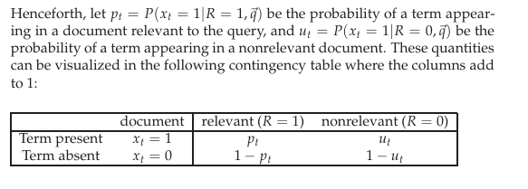
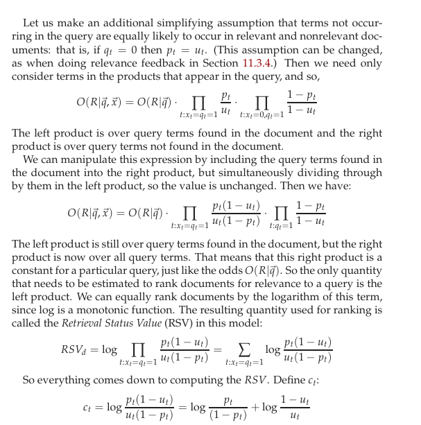
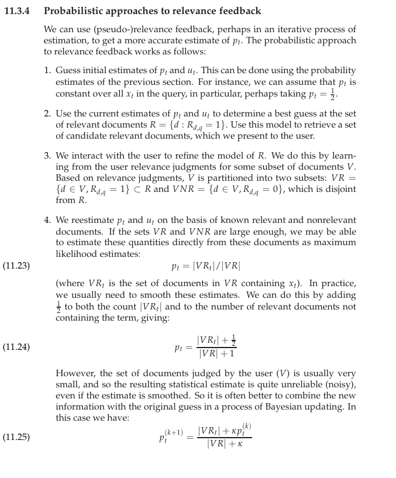

Aim: to calculate $P(R=1|\text{document}_i,\text{query})$ for each document and to produce a ranking based on this

R is indicator variable representing that the document is relevant for the query

## Probability Ranking Principle

Let x represent a document in the collection

Let R represent the relevance of a document wrt given (fixed) query
R = 1 represent relevant
R = 0 represent irrelevant

Need to find $p(R=1|x)$

$$ \begin{aligned}
    p(R=1|x) &= \frac{p(x|R=1)p(R=1)}{p(x)} \\
    p(R=0|x) &= \frac{p(x|R=0)p(R=0)}{p(x)} \\
    p(R=1|x) + p(R=0|x) &= 1 \\
\end{aligned} $$

NOTE: Instead of working with probabilities directly, we work with odds, because they are easier to compute under bayesian model.

$$O(A) = \text{odds}(A) = \frac{P(A)}{P(\bar{A})} =\frac{P(A)}{1-P(A)} $$

### Binary Independence Model
We also model documents as binary term vectors $\vec{x} = (0,1,0,0,\dots,1)$

$$
    O(R=1|q,x) = \frac{P(R=1|q,x)}{P(R=0|q,x)} 
= \frac{\frac{P(R=1|q)P(x|R=1,q)}{P(x|q)}}{\frac{P(R=0|q)P(x|R=0,q)}{P(x|q)}}
= \underbrace{\frac{P(R=1|q)}{P(R=0|q)}}_{\text{constant for a given query}} \cdot \overbrace{\frac{P(x|R=1,q)}{P(x|R=0,q)}}^{\text{needs to be estimated for each document}}
$$

To compute $\frac{P(x|R=1,q)}{P(x|R=0,q)}$, using independence assumptions, we can write

$$\frac{P(x|R=1,q)}{P(x|R=0,q)} = \prod_{t=1}^M \frac{P(x_t|R=1,q)}{P(x_t|R=0,q)}$$

Now, in [BIM](#binary-independence-model), $x_t \in \{0,1\}$

hence we can write

$$\frac{P(x|R=1,q)}{P(x|R=0,q)} = \prod_{t:x_t=1} \frac{P(x_t=1|R=1,q)}{P(x_t=1|R=0,q)} \prod_{t:x_t=0} \frac{P(x_t=0|R=1,q)}{P(x_t=0|R=0,q)}$$

Now,    

$$c_t = \log{\frac{p_t}{1-p_t}} + \log{\frac{1-u_t}{u_t}}$$

$$\log{\frac{1-u_t}{u_t}} = \log{\frac{N-df_t}{df_t}} \approx \log\frac{N}{df_t}$$ IDF !!

But estimating $p_t$ is harder.

 
Use an iterative method, initialize $p_t = 0.5$ for all terms and retrieve documents. 
Ask the user

$$p_t^{(k+1)} = \frac{|VR_t|+\kappa p_{t}^{(k)}}{|VR|+\kappa}$$

where $\kappa$ is the prior guess

## BM25 model

(aka Okapi model)

- was developed as a way of building a probabilistic model sensitive to term frequency and document length while not introducing too many additional parameters into the model 
- Words are drawn independently from the vocab using a *multinomial* distribution
    - $P(x = x_1x_2x_3\dots x_n) = \frac{(x_1+x_2+\dots+x_n)!}{x_1!x_2!\dots x_n!} p_1^{x_1}p_2^{x_2}\dots p_n^{x_n}$
- distribution of term frequencies (tf) follows a binomial distribution
    - approximated by a Poisson distribution
        - poisson distribution = $P(X=k) = \frac{\lambda ^k}{k!} e^{-\lambda}$
            - $\lambda$ is rate = number of occurrences per unit time
            - $k \in \{0,1,2,\dots,\infty\}$
        - This is true for "general" words, but is a poor fit for topic-specific words
            - get higher p(k) that predicted too often
- concept of "eliteness" (aka "aboutness")
    - binary variable (each term is either elite or not elite)
    - A term is elite in a document if, in some sense, the document is about the concept meant by the word

hence 2-Poisson model

- depending on whether the term is elite, it follows one of two poisson distributions
- $p(TF_i=k_i) = \pi \frac{\lambda ^k}{k!} e^{-\lambda} + (1-\pi) \frac{\mu^k}{k!} e^{-\mu}$
    - $\pi$ is the probability that the document is elite for a given term
    - calculating these three parameters $\mu, \lambda, \pi$ is difficult, so we can approximate this by the simple $\frac{tf}{k_1+tf}$
    - essentially saturation modelling

$$RSV^{BM25} = \sum_{i \in q} \log\frac{N}{df_i} \cdot  \frac{(k_1+1)tf_i}{k_1\left((1-b) + b \frac{dl}{avdl}\right) + tf_i}$$

where the tunable parameters are $k_1$ and $b$

Here $dl$ is the length of the document, $avdl$ is the average length of all documents in the collection

Here $b$ represents how much "normalization" we want ($b \in [0,1]$)

